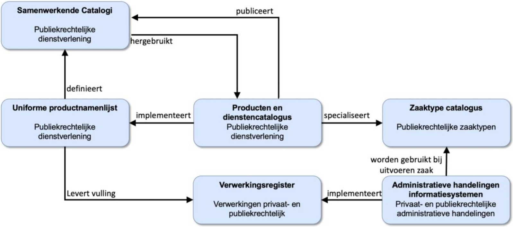

# Producttypecatalogus

## Product centraal

Zowel gemeenten als de VNG zijn ervan overtuigd dat producten en diensten die gemeenten leveren een belangrijke plaats innemen binnen de gemeentelijke informatievoorziening. Allereerst omdat gemeenten daarover met inwoners en ondernemers communiceren. Zij nemen immers ‘producten’ bij de gemeente af en niet bijvoorbeeld ‘zaken’. Maar ook omdat kenmerken van het te leveren product bepalen of zouden kunnen bepalen hoe het leveringsproces en verantwoording daarover eruit ziet. Denk hierbij aan (wettelijke) behandeltermijnen, grondslagen en machtigingen.

 
*Figuur 1 - Voorsgestelde samenhang tussen producttypen (beschikbaar in een Producten- en dienstencatalogus), de Universele Productnamenlijst (UPL), Zaaktypecatalogus (ZTC), Administratieve-handelingen en het Verwerkingenregister. Bron: [PDC, UPL, Zaaktypen, verwerkingsregister en administratieve handelingen](https://www.gemmaonline.nl/images/gemmaonline/d/dc/GEMMA_Gegevenslandschap_-_PDC_UPL_Zaaktypen_verwerkingsregister_en_adm_handelingen_v1_0.pdf) op GEMMA Online.*

Sinds een aantal jaren wordt op een aantal fronten gewerkt aan (verdergaande) standaardisatie van (gemeentelijke) producten en diensten. Dit betreft zowel de ‘inhoud’ (naamgeving, beschrijving etc.) als de vorm die wordt gevolgd voor vastlegging daarvan (welke kenmerken van producten registreren we volgens welke structuur). Een selectie:
- Vanuit het BZK-programma ‘machtigen’ wordt gekeken naar aanpassing en uitbreiding van de Universele Productnamenlijst (UPL).
- Voor de Omgevingswet is als onderdeel van het DSO een Producten- en dienstencatalogus ontwikkeld (en een onderliggend informatiemodel) ten behoeve van samenwerking tussen ketenpartners bij de uitvoering van de Omgevingswet (met name VTH-taken).
- Om te kunnen voldoen aan de eisen rondom productinformatie voortkomend uit de ‘Single Digital Gateway’-verordening (SDG) is door VNG Realisatie een voorziening ontwikkeld. Onderdeel daarvan was de afstemming van het hiervoor opgestelde informatiemodel met dat voor de Omgevingswet-PDC.
- De gemeente Buren heeft de ‘OpenPDC’ ontwikkeld om het publiceren van productinformatie op gemeentelijke websites en het hergebruik van die informatie te vereenvoudigen.
- De informatiebeveiligingsdienst (IBD) heeft een lijst van gemeentelijke verwerkingsactiviteiten ontwikkeld die gemeenten als basis kunnen gebruiken voor de verwerking van persoonsgegevens. De verwerkingsactiviteiten vertonen overlap met gemeentelijke producten en diensten.

Andere gemeenten zijn bezig te onderzoeken hoe ze producten kunnen gebruiken voor het bepalen of afleiden van toegangsregels tot dienstverleningsinformatie (Den Haag) of termijn- en informatiebeheerkenmerken (Tilburg). En eerder dit jaar heeft Dimpact opdracht gegeven voor het op basis van bestaande producten en gemeentelijke behoeften ontwikkelen van een ‘Informatiemodel PDC’.

## ‘Producttypen’ en concrete producten

Naar aanleiding van het bovenstaande is het belangrijk een onderscheid te maken dat we in de GEMMA-referentiearchitectuur niet kennen. In die architectuur kennen we het bedrijfsobject [‘product/dienst’](https://www.gemmaonline.nl/index.php/GEMMA2/0.9/id-df3013b1-70bc-11e4-67ab-0050568a6153) dat is gedefinieerd als "een tastbaar goed of verzameling activiteiten die door de gemeente geleverd kunnen worden". Kijken we echter naar het doel van de hierboven beschreven ontwikkeltrajecten, dan hebben die eigenlijk betrekking op iets wat we 'producttypen' (dit is een werkaanduiding) zouden kunnen noemen. Zo'n producttype bestaat in de context van een producten- en dienstencatalogus (waarvoor we de werkaanduiding ‘producttypecatalogus’ hanteren) en moet gezien worden als een beschrijving van een product, waaruit duidelijk wordt onder welke voorwoorden een exemplaar van dat product aan een inwoner of ondernemer geleverd kan worden. Hierbij horen kenmerken als wettelijke (lever)termijnen, kosten en grondslagen.

Tegenover producttypen staan concrete producten (ook een werkaanduiding): de exemplaren van een product van een bepaald producttype die in concrete gevallen aan inwoners en ondernemers geleverd gaan worden of al geleverd zijn. Bij concrete producten horen bijvoorbeeld kenmerken als een verloopdatum (in geval van een uitgegeven paspoort of rijbewijs), een periode (bij een verleende ontheffing) of een bedrag (horend bij een verstrekte subsidie).

Zoals uit de naam al blijkt, zijn deze repository en de hieronder beschreven activiteiten gericht op het beschrijven van producttypen. Concrete producten zullen worden bekeken voor zover eventuele relaties met producttypen daarom vragen, maar vormen nadrukkelijk geen primair aandachtsgebied van deze repository, noch van de uit te voeren activiteiten.

## ‘Kernmodel Producttypen’

Naar aanleiding van deze ontwikkelingen is aan de VNG gevraagd een informatiemodel voor producten en diensten vast te (laten) stellen. In reactie hierop voert de VNG voert in 2022 een beperkt aantal activiteiten uit. Deze leiden tot een ‘kern(informatie)model Producttypecatalogus’. Dit kernmodel biedt ons de mogelijkheid om de (resultaten van de) hierboven beschreven ontwikkelingen te toetsen op samenhang. En het biedt partijen die betrokken zijn bij die ontwikkelingen de mogelijkheid om in eigen behoeften te voorzien en tegelijkertijd onderlinge samenhang te waarborgen.

Het kernmodel model omvat die objecten, kenmerken en relaties die VNG en gemeenten beschouwen als ‘in ieder geval noodzakelijk’ binnen een gemeentelijke PDC. Daarbij laten we de mogelijkheid open dit ‘kernmodel’ later uit te breiden. Dit model bieden we gemeenten zonder verplichting tot gebruik ter referentie aan – we stellen het dus niet formeel vast. Wel hebben we hierbij de intentie dat dit model ‘klopt’. Een (beperkte) analyse van bestaande modellen en gemeentelijke behoeften moet dit waarborgen.

We hoeven bij de ontwikkeling van het kernmodel niet bij nul te beginnen. Eind 2021 is (naar aanleiding van de afstemming tussen Omgevingswet en SDG) een [0.7-versie van het CimPDC](./docs/assets/CimPDCv0_7.pdf) opgeleverd. Dit CimPDC dient als uitgangspunt voor het ‘kernmodel Producttypecatalogus’.

## Wat gaan we doen?

Om te komen tot het hierboven beschreven kernmodel worden de volgende activiteiten uitgevoerd:
1. Analyse van bestaande modellen (CimPDC, OpenPDC gemeente Buren, resultaten opdracht Dimpact) en gebruikswensen van gemeenten en leveranciers;
2. Check op aansluiting van genoemde modellen bij internationale standaarden (met name het Europese ‘Core Public Service Vocabulary Application Profile’);
3. Afstemming concepten met betrokken gemeenten en leveranciers, en
4. Publicatie van 1.0-versie ‘kernmodel’ Gemeentelijke PDC, inclusief beschrijving van hoe extensies aan de kern gerealteerd kunnen worden en een beperkt aantal architectuuruitwerkingen die de toepassing illustreren.

## Hoe kan ik bijdragen?

Bij het uitvoeren van bovengenoemde activiteiten hebben we hulp nodig van gemeenten en andere betrokkenen. Bijdragen kan op verschillende manieren:
1. Het indienen van een [user story](https://github.com/VNG-Realisatie/producttypecatalogus/issues/new?assignees=&labels=user+story&template=user-story--als-----wil-ik-----.md&title=Als+%5Bvul+aan%5D) die een functioneel beschreven (beoogde) toepassing van producttypen beschrijft.
2. Hierboven is reeds een aantal bestaande modellen genoemd waarnaar we tijdens het bepalen van het 'kernmodel' gaan kijken. Waarschijnlijk is dit overzicht echter niet compleet. Andere voorbeelden van binnen of buiten gemeenten gebruikte modellen voor het beschrijven van product(type)informatie zijn daarom van harte welkom. Deze kunnen worden (met link of bijlage) als [voorbeeld](https://github.com/VNG-Realisatie/producttypecatalogus/issues/new?assignees=&labels=&template=voorbeeldmodel-product-typ-en.md&title=) in deze Github-omgeving worden ingediend.

## Documentatie

Documentatie over inhoud en proces bij dit project is te vinden in [De docs-map van deze omgeving](./docs).

*[to do: verzamelen, uploaden van en invoegen verwijzingen naar CimPDC, OpenPDC gemeente Buren, resultaten opdracht Dimpact]*

## Andere vragen of opmerkingen?

Stuur een mail naar [gemmaonline@vng.nl](mailto:gemmaonline@vng.nl).